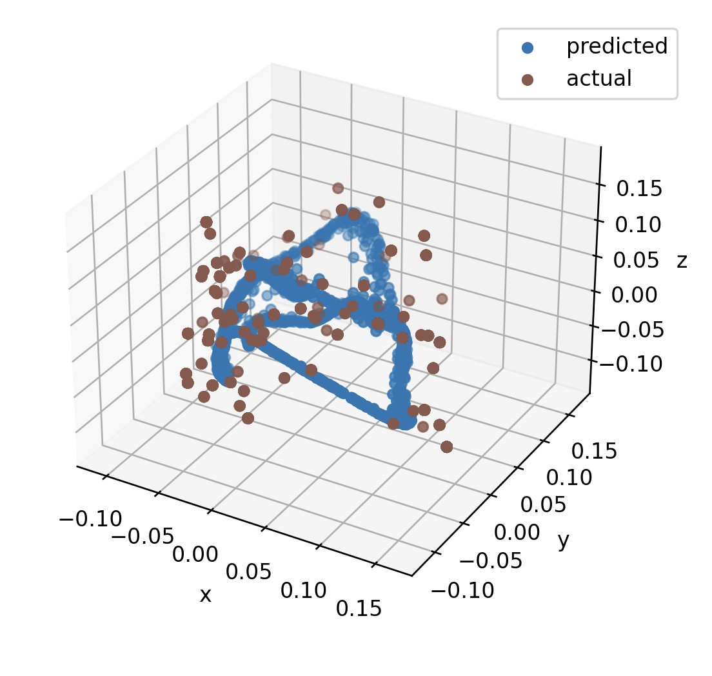

# inflection
Experimenting with the [Joint Embedding Predictive Architecture](https://arxiv.org/abs/2301.08243) (JEPA) to predict natural language embeddings of solutions to mathematical expressions. Given an embedding of an expression like "three times four", the objective is to predict an embedding closest to the embedding of the solution: "twelve". Predicted solution embeddings are evaluated against the actual solution embeddings and a range of embeddings on a regular interval.

